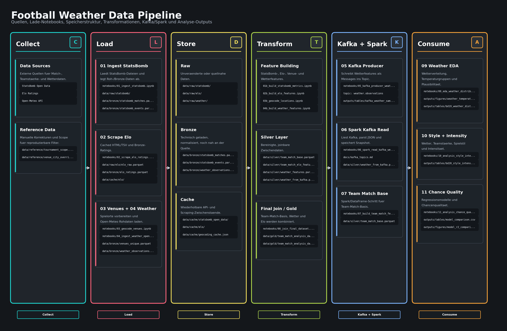

# Football Weather Big Data Analytics

Big-Data-Engineering-Projekt zur Frage:

> Wie haengen Wetterbedingungen und Teamstaerke mit Spielstil und Chancenqualitaet bei internationalen Fussballturnieren zusammen?

Das Projekt kombiniert Eventdaten, Wetterdaten und Teamstaerke, um Spielstil-Metriken auf Team-Spiel-Ebene zu analysieren. Ein Spiel wird dabei als zwei Team-Match-Beobachtungen modelliert.

## Datenquellen

- StatsBomb Open Data: Event- und Matchdaten als Dateiquelle, z. B. xG, Schuesse, Paesse, Pressing und weitere Spielereignisse.
- Open-Meteo API: Wetterdaten zu Spielort und Spielzeit, insbesondere Temperatur, gefuehlte Temperatur und Niederschlag.
- Elo Ratings: Teamstaerke vor dem Spiel per Web Scraping; daraus wird `elo_diff = team_elo - opponent_elo` berechnet.

## Analysefokus

Untersucht werden internationale Turniere wie WM 2018, WM 2022, Euro 2020, Euro 2024, AFCON 2023 und Copa America 2024. Die Wettervariablen werden roh fuer Korrelationen und Regressionen genutzt. Fuer Visualisierungen werden Temperaturgruppen gebildet:

- `cold`: unter 10 Grad Celsius
- `mild`: 10 bis 20 Grad Celsius
- `warm`: 20 bis 28 Grad Celsius
- `hot`: ueber 28 Grad Celsius

Elo-Differenzen werden fuer die Interpretation in `favorite`, `balanced` und `underdog` gruppiert.

## Projektstruktur

```text
.
├── data/
│   ├── raw/       # unveraenderte Quelldaten
│   ├── bronze/    # technisch geladene und normalisierte Rohdaten
│   ├── silver/    # bereinigte, joinbare Zwischendaten
│   ├── gold/      # finale Analyse- und Modellierungsdaten
│   └── cache/     # temporaere API-, Scraping- und Pipeline-Caches
├── docs/          # ergaenzende Projektdokumentation
├── issues/        # lokale BD-Issue-Dateien
├── notebooks/     # Jupyter Notebooks fuer die Projektschritte
└── outputs/
    ├── figures/   # exportierte Diagramme
    └── tables/    # exportierte Tabellen
```

## Pipeline-Idee

1. Daten aus Dateiquelle, REST API und Web Scraping laden.
2. Mindestens eine Datenquelle ueber Kafka Topics bereitstellen.
3. Kafka-Daten mit Spark lesen und transformieren.
4. Team-Match-Dataset mit Wetter- und Elo-Features joinen.
5. Finale Analyse- und Ergebnisdaten in `data/gold/` oder `outputs/` speichern.
6. Ergebnisse visualisieren und Data Flow dokumentieren.

Die Umsetzung folgt einer reproduzierbaren Big-Data-Pipeline: externe Quellen
werden zuerst kontrolliert geladen, danach in klaren Bronze-/Silver-/Gold-Stufen
transformiert und fuer den Kafka/Spark-Teil ueber ein definiertes JSON-Topic
ausgetauscht.

## Data Pipeline




Die Grafik liegt unter `outputs/figures/DataGraph.png`.

Die Pipeline trennt Quellen, Laden, Speichern, Transformation, Transport und Analyse:

- `01`, `02`, `03` und `04` laden externe Daten und schreiben Roh-, Bronze- und Cache-Artefakte.
- `01b`, `02b`, `03b`, `04b` und `07` transformieren die Daten zu joinbaren Silver-Features.
- `05` publiziert Wetterfeatures in Kafka; `06` liest das Topic mit Spark und speichert den strukturierten Snapshot.
- `08` verbindet Team-Match-Basisdaten, Wetterdaten und Elo-Features zum Gold-Dataset.
- `09`, `10` und `11` lesen aus `data/gold/` und erzeugen fachliche Tabellen und Visualisierungen in `outputs/`.
- `12` buendelt die finalen Praesentationsgrafiken und die Ergebnisstory fuer die Abschlussfolien.

Die detaillierte Notebook-Konvention mit Inputs, Outputs und Data Flow steht in
[`docs/notebook_data_flow.md`](docs/notebook_data_flow.md).
Die Kafka-Topic-Namen, Message-Keys und JSON-Schemas sind in
[`docs/kafka_topics.md`](docs/kafka_topics.md) dokumentiert.

## Notebook-Reihenfolge

Die nummerierten Notebooks bilden die reproduzierbare Projektpipeline. Die ersten
Lade-Notebooks koennen wegen API-, Scraping- und StatsBomb-Daten laenger dauern;
die spaeteren Transformations- und Analyse-Notebooks lesen die erzeugten
Zwischenartefakte aus `data/`.

| Schritt | Notebook | Zweck |
| --- | --- | --- |
| 00 | `notebooks/00_project_overview.ipynb` | Forschungsfrage, Scope und Team-Match-Ebene dokumentieren |
| 01 | `notebooks/01_ingest_statsbomb.ipynb` | StatsBomb Match- und Eventdaten laden |
| 01b | `notebooks/01b_build_statsbomb_metrics.ipynb` | Eventdaten zu Team-Match-Metriken aggregieren |
| 02 | `notebooks/02_scrape_elo_ratings.ipynb` | Elo-Ratings per Web Scraping laden |
| 02b | `notebooks/02b_build_elo_features.ipynb` | Elo-Differenz und Elo-Gruppen berechnen |
| 03 | `notebooks/03_geocode_venues.ipynb` | Spielorte normalisieren |
| 03b | `notebooks/03b_geocode_locations.ipynb` | Koordinaten fuer Wetterabfragen erzeugen |
| 04 | `notebooks/04_ingest_weather_openmeteo.ipynb` | Wetterdaten ueber Open-Meteo laden |
| 04b | `notebooks/04b_build_weather_features.ipynb` | Wetterfeatures und Temperaturgruppen bauen |
| 05 | `notebooks/05_kafka_producer_weather.ipynb` | Wetterfeatures in Kafka Topic `weather.observations` schreiben |
| 06 | `notebooks/06_spark_read_kafka_weather.ipynb` | Kafka-Wetterdaten mit Spark lesen und als Silver-Snapshot speichern |
| 07 | `notebooks/07_build_team_match_features.ipynb` | Team-Match-Basisdataset erzeugen |
| 08 | `notebooks/08_join_final_dataset.ipynb` | Wetter, Elo und Team-Match-Basisdaten zum Gold-Dataset joinen |
| 09 | `notebooks/09_eda_weather_distribution.ipynb` | Wetterverteilung und Plausibilitaet analysieren |
| 10 | `notebooks/10_analysis_style_intensity.ipynb` | Spielstil, Intensitaet und Ballkontrolle untersuchen |
| 11 | `notebooks/11_analysis_chance_quality_model.ipynb` | Chancenqualitaet und Regressionsmodelle vergleichen |
| 12 | `notebooks/12_final_presentation_graphics.ipynb` | Finale Praesentationsgrafiken und Storyline erzeugen |

`notebooks/environment_check.ipynb` ist ein Hilfsnotebook fuer Docker, Kafka und
Spark. Es ist kein fachlicher Pipeline-Schritt.

## Ergebnisse

Die wichtigsten Ergebnisartefakte werden lokal erzeugt und wegen Groesse bzw.
Reproduzierbarkeit nicht alle committed:

- Pipeline-Grafik: `outputs/figures/DataGraph.png`
- Finale Analysedaten: `data/gold/team_match_analysis_dataset.parquet` und `.csv`
- Wetterverteilung: `outputs/tables/bd19_weather_distribution_summary.csv`
- Data-Quality-Checks: `outputs/tables/data_quality_summary.csv`,
  `outputs/tables/bd17_join_quality_summary.csv`
- Modellvergleich: `outputs/tables/model_comparison.csv`,
  `outputs/tables/model_incremental_comparison.csv`,
  `outputs/figures/model_r2_comparison.png`
- Praesentationsstruktur: `docs/presentation_outline.md`
- Finale Praesentationsgrafiken: `notebooks/12_final_presentation_graphics.ipynb`
  erzeugt `outputs/figures/presentation_*.png`
- Codefreie Praesentationsstory: `docs/final_presentation_story.md`

Fachlich zeigt der Modellvergleich, dass Wettervariablen als Kontextsignale
brauchbar sind, die relative Teamstärke über `elo_diff` aber deutlich
mehr Varianz erklärt. Im aktuellen Lauf erreicht `weather_only` für
Team-xG ein R² von 0.0032, `elo_only` 0.0752. Bei `successful_passes`
liegt `weather_only` bei R² 0.0288 und `elo_only` bei 0.2625.

## Limitierungen

- Die Analyse ist explorativ und zeigt Zusammenhaenge, keine kausalen Effekte.
- Der Datensatz ist fuer Regressionsmodelle relativ klein: 314 Matches bzw. 628
  Team-Match-Beobachtungen.
- Wetter wird als Kontext am Spielort und zur Spielzeit modelliert; konkrete
  Stadionbedingungen wie Dach, Rasen, Wind im Stadion oder lokale Mikroklimata
  sind nicht vollstaendig messbar.
- Regenfaelle sind im Turnierscope ungleich verteilt und werden deshalb
  vorsichtig interpretiert.
- Wind steht nicht im Fokus, weil robuste stadionnahe Windinformationen und
  deren sportliche Interpretation fuer diese Abgabe nicht ausreichend stabil
  waeren.

## Lokale Big-Data-Umgebung

Die lokale Umgebung wird mit Docker Compose gestartet:

```bash
docker compose up
```

Danach ist Jupyter Lab unter <http://localhost:8888> erreichbar. Der Jupyter-Container enthaelt PySpark und nutzt Spark lokal im Notebook. Kafka laeuft als separater Broker:

- aus Jupyter: `kafka:29092`
- vom Host-Rechner: `localhost:9092`

Zusaetzliche Python-Abhaengigkeiten fuer Scraping, Parquet und Kafka stehen in
`requirements.txt`. Falls ein Notebook eine Dependency vermisst, kann sie im
Jupyter-Terminal mit `pip install -r /home/jovyan/work/requirements.txt`
installiert werden.

Die Projektordner `notebooks/`, `data/`, `outputs/` und `docs/` sind im Notebook unter `/home/jovyan/work/` sichtbar. Das Notebook `notebooks/environment_check.ipynb` prueft die gemounteten Ordner, die Kafka-Erreichbarkeit und das Starten einer `SparkSession`. Es gehoert nicht zur nummerierten Analyse-Pipeline.

Fuer die Ausfuehrung gegen eine lokale Umgebung oder einen bereitgestellten Cluster lesen die Notebooks Verbindungen aus Umgebungsvariablen:

- `SPARK_MASTER`, lokal: `local[*]`, Cluster: `spark://172.29.16.102:7077`
- `KAFKA_BOOTSTRAP_SERVERS`, lokal: `kafka:29092`, Cluster: `172.29.16.101:9092`

Im Cluster wird JupyterHub ueber <http://172.29.16.104:8000/hub/> genutzt. Die Cluster-Adressen sind nur ueber VPN erreichbar.

## Hinweise zum Repository

Grosse Daten, Cache-Dateien und generierte Artefakte werden standardmaessig nicht committed.

Vor einer GitHub-Abgabe sollte `git status --ignored --short` geprueft werden.
Erwartet ist, dass Rohdaten, Bronze-/Silver-/Gold-Daten, Cache-Dateien, Tabellen,
die finale Praesentationsdatei und lokale Inspect-Dateien ignoriert bleiben.
Committed werden sollen vor allem Code, Notebooks, Dokumentation, Konfiguration,
kleine Referenzdateien und die Pipeline-Grafik `outputs/figures/DataGraph.png`.
