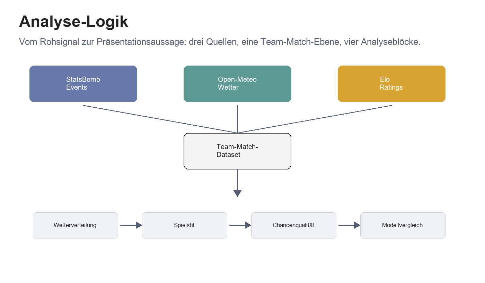
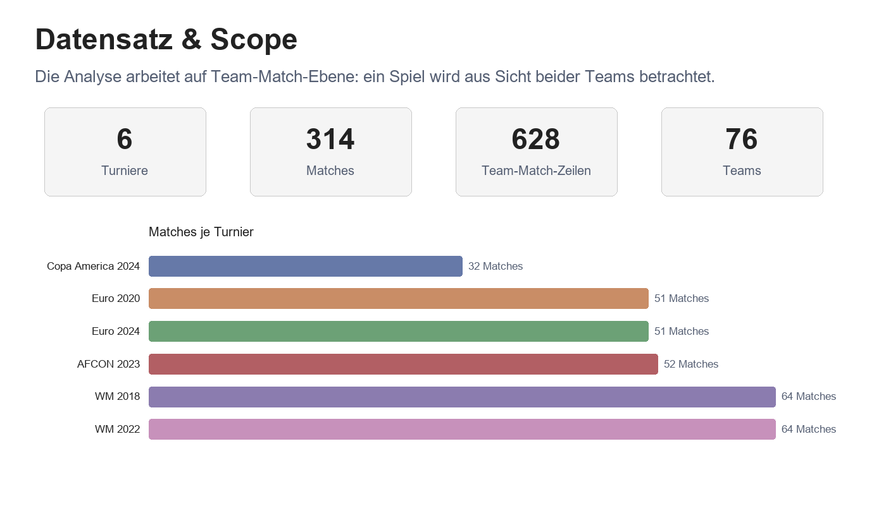
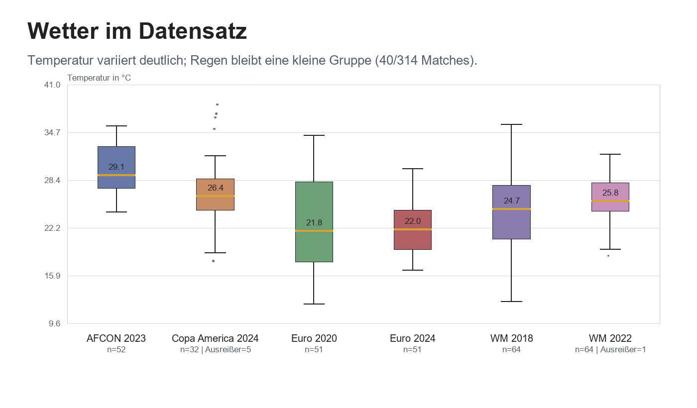
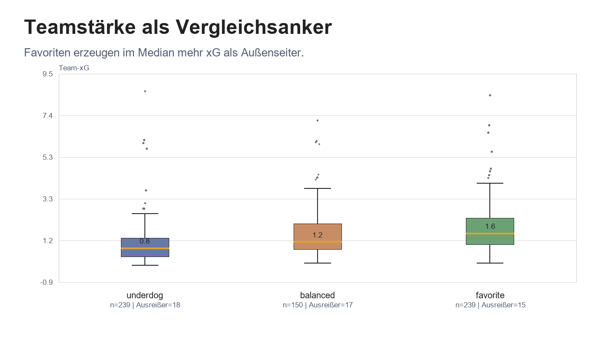
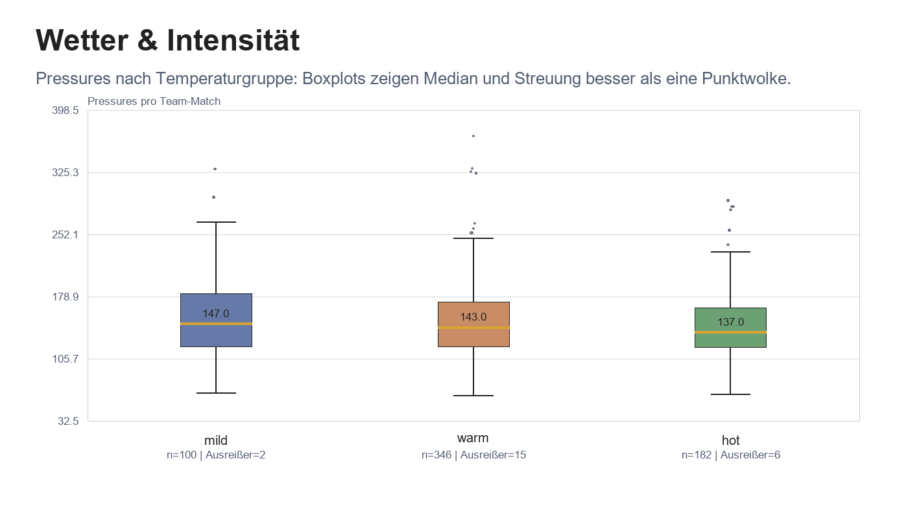
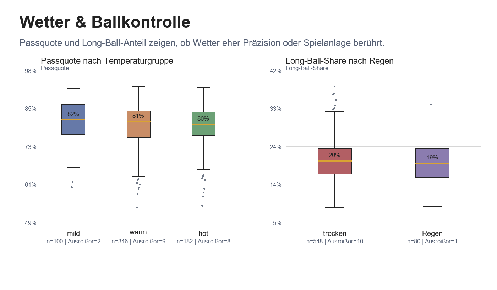
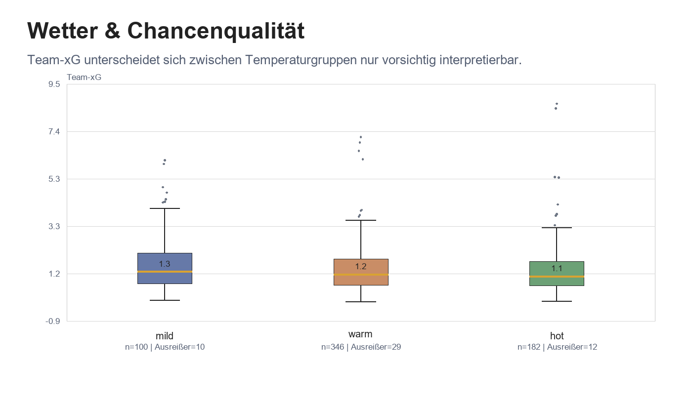
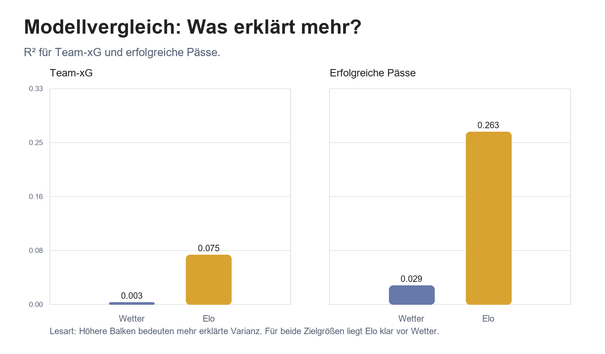

# Finale Präsentationsgrafiken und Story

Dieses Notebook bündelt die Grafiken für die Abschlusspräsentation. Es liest das finale Team-Match-Dataset und formt daraus eine zusammenhängende Ergebnisgeschichte: Wetter ist als Kontext sichtbar, aber Teamstärke erklärt Team-xG deutlich besser.

## Leitfrage

Wie hängen Wetterbedingungen und Teamstärke mit Spielstil und Chancenqualität bei internationalen Fußballturnieren zusammen?

Die Antwort entsteht nicht aus einem einzelnen Plot. Wir gehen Schritt für Schritt vor: erst Datenlogik und Scope, dann Wetterkontext, danach Spielstil und Chancen, und am Ende der Modellvergleich.

## Datenbasis

Für reine Wetterverteilungen wird jedes Match nur einmal gezählt. Für Spielstil, Chancenqualität und Teamstärke bleibt die Team-Match-Ebene erhalten, weil jede Mannschaft im selben Spiel eigene Werte für xG, Pressures und Passquote hat.

## Von drei Quellen zur Analyseidee

Die erste Grafik ersetzt den technischen DataGraph in der Präsentation. Sie zeigt nicht jede Pipeline-Stufe, sondern die Denklogik der Analyse.

StatsBomb beschreibt das Verhalten auf dem Platz, Open-Meteo den Wetterkontext am Spielort und Elo die relative Teamstärke. Erst auf Team-Match-Ebene werden diese Perspektiven vergleichbar: ein Spiel wird aus Sicht beider Teams gelesen.

So entsteht die Dramaturgie: Wetterverteilung, Spielstil, Chancenqualität und Modellvergleich bauen aufeinander auf.

## Was genau wird verglichen?

Bevor wir Effekte interpretieren, braucht die Präsentation ein Gefühl für den Scope.

Die sechs Turniere ergeben 314 Matches. Da wir pro Team und Match analysieren, entstehen 628 Team-Match-Zeilen. Diese Ebene ist wichtig, weil xG, Pressures, Passquote und Long-Ball-Share immer aus Sicht eines Teams gemessen werden.

Der Datensatz ist groß genug für explorative Vergleiche, aber klein genug, dass Ausreißer und Gruppengrößen sichtbar mitgedacht werden müssen.

## Wetter ist im Datensatz sichtbar

Jetzt prüfen wir, ob Wetter überhaupt genug Streuung hat, um als Kontextvariable interessant zu sein.

Die Turniere decken unterschiedliche Temperaturbereiche ab. Einige Wettbewerbe liegen klar im warmen Bereich, andere haben eine breitere Streuung. Regen ist vorhanden, bleibt aber eine kleine Gruppe.

Für die Präsentation heißt das: Temperaturgruppen eignen sich besser für Vergleiche; Regen ist eher ein ergänzendes Kontextsignal.

## Teamstärke als sportlicher Vergleichsanker

Bevor Wetter interpretiert wird, brauchen wir einen sportlichen Referenzpunkt. Elo liefert genau diesen Vergleichsanker.

Favoriten erzeugen im Median mehr xG als Außenseiter. Das passt zur sportlichen Erwartung: stärkere Teams kommen häufiger in gute Abschlusspositionen.

Diese Beobachtung ist wichtig für die spätere Punchline. Wenn Elo bereits sichtbar mit xG zusammenhängt, dürfen Wetterplots nicht isoliert überinterpretiert werden.

## Intensität: sichtbare Streuung statt einfacher Effekt

Pressures sind unsere wichtigste Intensitätsmetrik. Der Boxplot ist hier hilfreicher als eine Punktwolke, weil Median, Streuung und Ausreißer direkt sichtbar werden.

Die Medianwerte unterscheiden sich nicht dramatisch, gleichzeitig gibt es einzelne sehr intensive Team-Matches. Die Ausreißer werden bewusst nur dezent gezeigt, weil sie erklären, warum einzelne Extremspiele die Interpretation verzerren können.

Die saubere Aussage lautet: Temperaturgruppen zeigen Unterschiede in der Verteilung, aber kein eindeutiges Signal, das allein auf Wetter zurückgeführt werden sollte.

## Ballkontrolle: Präzision und Spielanlage

Ballkontrolle betrachten wir über zwei Perspektiven: Passquote als Präzision und Long-Ball-Share als Hinweis auf Spielanlage.

Die Passquote bleibt über Temperaturgruppen hinweg relativ stabil. Beim Long-Ball-Share ist der Regenvergleich interessant, aber die Regen-Gruppe ist deutlich kleiner.

Damit wird die Aussage differenziert: Wetter kann als Kontext sichtbar sein, aber die Verteilungen sprechen nicht für einen einfachen, linearen Wettereinfluss auf Ballkontrolle.

## Chancenqualität bleibt vorsichtig zu lesen

Team-xG fasst Chancenmenge und Chancenqualität zusammen. Genau deshalb ist die Streuung hier besonders wichtig.

Die Temperaturgruppen unterscheiden sich leicht, aber die Streuung ist groß. Einzelne Team-Matches erzeugen sehr hohe xG-Werte und werden als Ausreißer markiert.

Für die Präsentation ist das eine vorsichtige Folie: Wettergruppen schwanken, aber Wetter allein erklärt Team-xG nicht überzeugend.

## Der Modellvergleich setzt die Gewichtung

Am Ende vergleichen wir Wetter und Teamstärke direkt als Erklärungsfaktoren. Damit die Punchline nicht nur auf Team-xG beruht, zeigt die Grafik zwei Zielgrößen nebeneinander: Chancenqualität und Ballkontrolle.

Der Unterschied ist in beiden Panels klar. Für Team-xG liegt Wetter allein bei R² 0.003, Elo bei R² 0.075. Bei erfolgreichen Pässen wird der Abstand noch deutlicher: Wetter allein erreicht R² 0.029, Elo R² 0.263.

Die Kernaussage ist damit einfacher: Wetter ist Kontext, Teamstärke erklärt mehr.

## Fazit

Wetter ist im Datensatz sichtbar: Temperatur unterscheidet sich zwischen Turnieren, Regen kommt vor, bleibt aber selten.

Spielstil- und Chancenmetriken schwanken zwischen Wettergruppen. Die Boxplots zeigen aber auch, dass Streuung und Ausreißer groß genug sind, um vorsichtig zu bleiben.

Die stärkste Ergebnisbotschaft kommt aus dem Modellvergleich: Elo beziehungsweise Teamstärke erklärt Team-xG und erfolgreiche Pässe deutlich besser als Wetter. Wetter ist Kontext, nicht Haupttreiber.
